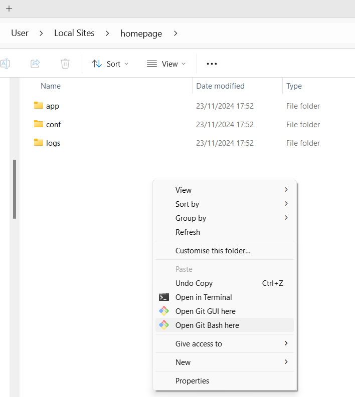
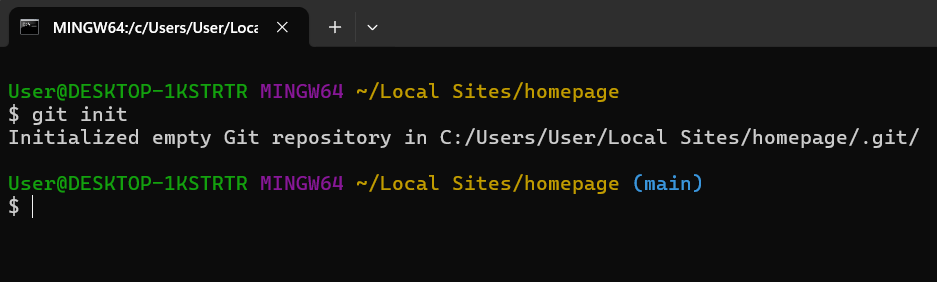
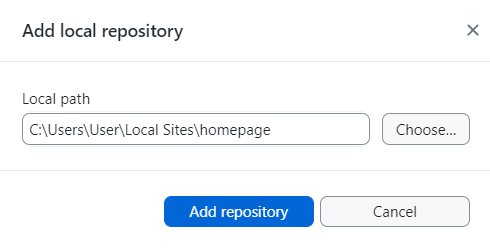

# Setting Up and Collaborating on a WordPress Website Linked to GitHub  

This guide covers how to:  
1. **Set up a new WordPress website linked to GitHub.**  
2. **Collaborate on an existing WordPress website linked to GitHub.**  

---  

## Prerequisites  

**Ensure you have the following prerequisites in place before proceeding to the next sections on creating or collaborating on a WordPress website linked to GitHub.**  

### 1. Install Git Locally  
#### 1.1 Check if Git is Installed  
1. Open your terminal (Mac) or command prompt (Windows).  
2. Run: `git --version`.  
   - If installed, you’ll see the version number.  
   - If not, proceed to the next step.  

#### 1.2 Install Git  
- **Windows:** [Download Git for Windows](https://gitforwindows.org/).  
- **Mac:** [Download Git for Mac](https://sourceforge.net/projects/git-osx-installer/).  

#### 1.3 Install GitHub Desktop  
- Download and install [GitHub Desktop](https://desktop.github.com/) for an intuitive interface.  

### 2. Install Local by Flywheel  
- Download and install [Local by Flywheel](https://localwp.com/).  
- Sign up for Local using your GitHub account.  

---  

## Part 1: Setting Up a New WordPress Website Integrated with GitHub  

**Follow this section if you are starting a new website that you want to host on GitHub.**  

### Step 1: Create a GitHub Repository  
1. Log in to GitHub and create a new repository (e.g., `new_homepage`).  
2. This repository will host your static WordPress site.  

### Step 2: Create a WordPress Website  
1. Open Local by Flywheel and select **Create New Site**.  
2. Follow the prompts to set up your WordPress site (e.g., `homepage`).  
3. When prompted to choose your environment, select Custom Environment and imput the following settings:
- PHP Version: Choose 8.2.23.
- Web Server: Choose Apache 2.4.43.
- Database: Choose MySQL 8.0.16.

<div style="text-align: center;">
  
  
  
  <p>Create a WordPress website in Local.</p>
</div>


### Step 3: Navigate to the Site Folder and Initialize Git  
1. Locate the site folder created by Local by Flywheel:  
   - Open Local by Flywheel.  
   - Find your site in the list and select the **Site folder** button found below the site title.   

<div style="text-align: center;">
    
    <p style="margin-top: 10px; font-style: italic;">Navigate to the site folder.</p>
</div>


2. Open Git Bash in the Site Folder:  
   - Right-click inside the site folder in the file explorer.  
   - Select **Open Git Bash Here** from the context menu.  

<div style="text-align: center;">
    
    <p style="margin-top: 10px; font-style: italic;">Open Git Bash.</p>
</div>

3. Initialize Git:  
   - In the Git Bash window that opens, type the following command:  
     ```
     git init  
     ```  
   - Press **Enter**. This initializes a local Git repository, enabling you to connect the site to GitHub Desktop later.  

<div style="text-align: center;">
    
    <p style="margin-top: 10px; font-style: italic;">Initialize Git.</p>
</div>

### Step 4: Connect GitHub with GitHub Desktop  
1. Clone the **host repository** (e.g., `new_homepage`) to your local machine using GitHub Desktop.  
   - Select **File > Clone repository** .  
   - Insert the URL of the repository you want to clone, and define the local path.  

<div style="text-align: center;">
    
    <p style="margin-top: 10px; font-style: italic;">Clone host repository.</p>
</div>

2. Publish the **source repository** (e.g., `homepage_wordpress`) by linking the Local site folder to GitHub Desktop. 
   - Select **File > Add local repository** .  
   - Link the Local site folder as your local path and add the repository.
   - Publish the repository to GitHub. 

<div style="text-align: center;">
    
    <p style="margin-top: 10px; font-style: italic;">Clone host repository.</p>
</div>

### Step 5: Convert WordPress to Static HTML  
#### 5.1 Install and Configure Simply Static Plugin  
1. In Local, access **WP Admin** and log in.  
2. Go to **Plugins → Add New** and search for "Simply Static".  
3. Install and activate the plugin.  

<div style="text-align: center;">
    
    <p style="margin-top: 10px; font-style: italic;">Install Simply Static Plugin.</p>
</div> 

4. Configure settings under **Simply Static**:  
   - **General Settings**:  
     - Replace URLs: Set to **Relative Path**.  
     - Path: Specify the path of the host repository (e.g., `/new_homepage`).  
     - Enable **Force URL Replacements**.  
   - **Deploy Settings**:  
     - Deployment Method: **Local Directory**.  
     - Path: Specify the local path to the cloned host repository.  

<div style="display: flex; justify-content: center; gap: 10px;">
    
    
    <p style="margin-top: 10px; font-style: italic;">Configure Simply Static settings.</p>
</div>

#### 5.2 Generate Static Files  
1. Go to **Simply Static → Generate**.  
2. Click **Generate Static Files** to export the site as static HTML with rewritten URLs.  

<div style="text-align: center;">
    
    <p style="margin-top: 10px; font-style: italic;">Generate static files.</p>
</div> 

### Step 6: Push Static HTML to GitHub  
1. Open GitHub Desktop.  
2. Push changes from the local repository to the host repository by clicking **Push Origin**.  
3. Stop the Local site from the 'Stop site' button at the top-right corner on Local before pushing or pulling changes to avoid conflicts.  

<div style="text-align: center;">
    
    <p style="margin-top: 10px; font-style: italic;">Stop site from Local before pushing or pulling changes.</p>
</div> 

### Step 7: Repeat for Updates  
- For updates, repeat the process of generating static files and pushing them to GitHub.  

---  

## Part 2: Collaborating on an Existing Linked Website  

**Follow this section if you want to collaborate on a WordPress website that is hosted on GitHub.**  

### Step 1: Export and Import the Website  
1. In Local, click the three dots next to the site name and select **Export**.  
2. Share the ZIP file with collaborators.  
3. On the collaborator’s machine, drag the ZIP file into Local to import the site.  

### Step 2: Connect GitHub with GitHub Desktop  
1. Clone the host repository to the collaborator's GitHub Desktop.  
2. For the source repository:  
   - Navigate to the imported Local site folder, which already contains a `.git` file.  
   - Open this repository in GitHub Desktop to sync it with the source repository on GitHub.  

### Step 3: Convert WordPress to Static HTML and Push Changes  
- Follow **Steps 5 and 6** from the "Setting Up a New Website" section to generate static files and push changes to GitHub.  

---  

By following these steps, you’ll ensure a smooth setup and collaborative workflow for a WordPress site integrated with GitHub.  