# Setting Up and Collaborating on a WordPress Website Linked to GitHub  

This guide covers how to:  
1. **Set up a new WordPress website linked to GitHub.**  
2. **Collaborate on an existing WordPress website linked to GitHub.**  

---  

## Prerequisites  

**Ensure you have the following prerequisites in place before proceeding to the next sections on creating or collaborating on a WordPress website linked to GitHub.**  

### 1. Install Git Locally  
#### 1.1 Check if Git is Installed  
1. Open your terminal (Mac) or command prompt (Windows).  
2. Run: `git --version`.  
   - If installed, you’ll see the version number.  
   - If not, proceed to the next step.  

#### 1.2 Install Git  
- **Windows:** [Download Git for Windows](https://gitforwindows.org/).  
- **Mac:** [Download Git for Mac](https://sourceforge.net/projects/git-osx-installer/).  

#### 1.3 Install GitHub Desktop  
- Download and install [GitHub Desktop](https://desktop.github.com/) for an intuitive interface.  

### 2. Install Local by Flywheel  
- Download and install [Local by Flywheel](https://localwp.com/).  
- Sign up for Local using your GitHub account.  

---  

## Part 1: Setting Up a New WordPress Website Integrated with GitHub  

**Follow this section if you are starting a new website that you want to host on GitHub.**  

### Step 1: Create GitHub Repositories  
1. Log in to GitHub and create two repositories:  
   - **Host Repository:** This repository will store the static version of your WordPress site (e.g., `new_homepage`).  
   - **Source Repository:** This repository will store the source files of your WordPress site (e.g., `homepage_wordpress`).  

### Step 2: Create a WordPress Website  
1. Open Local by Flywheel and select **Create New Site**.  
2. Follow the prompts to set up your WordPress site (e.g., `homepage`).  
3. When prompted to choose your environment, select Custom Environment and imput the following settings:
- PHP Version: Choose 8.2.23.
- Web Server: Choose Apache 2.4.43.
- Database: Choose MySQL 8.0.16.

  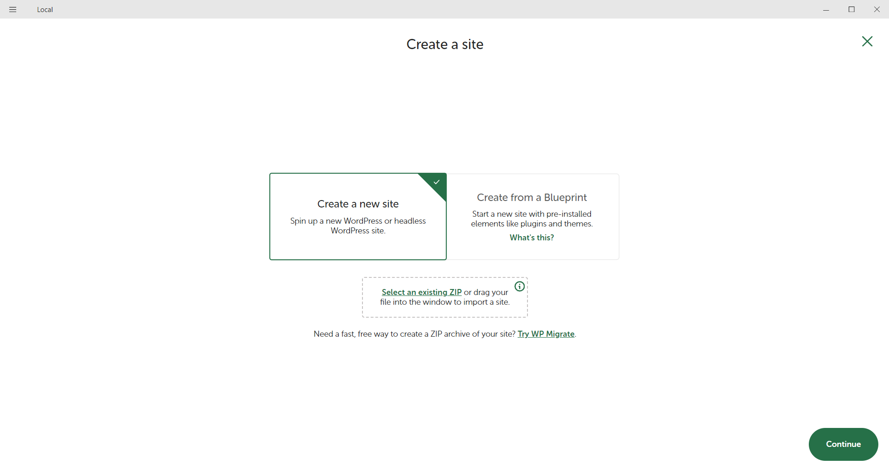
  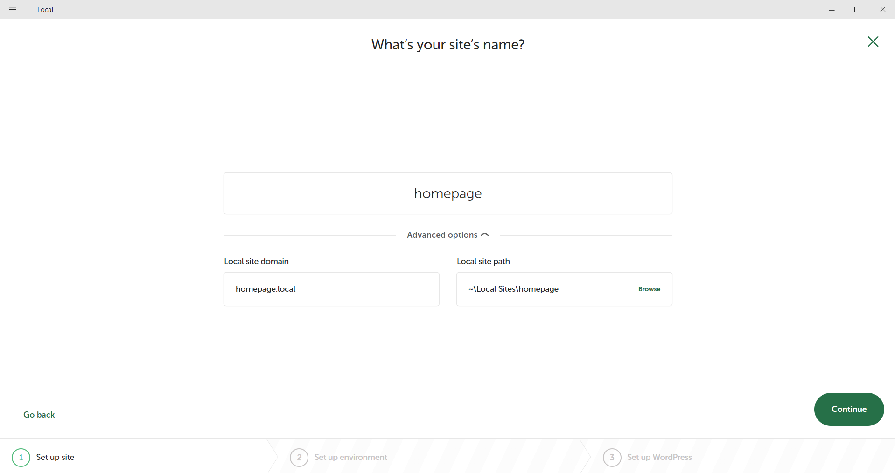
  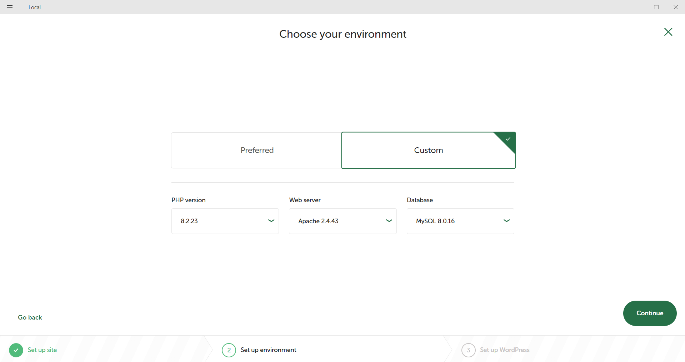

### Step 3: Connect GitHub with GitHub Desktop  
1. Clone the **Host Repository** (e.g., `new_homepage`) to your local machine:  
   - Open GitHub Desktop.  
   - Select **File > Clone Repository**.  
   - Insert the URL of the host repository and define the local path.  

    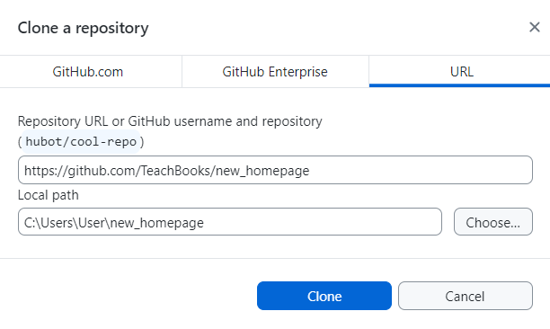

  

2. Clone the **Source Repository** (e.g., `homepage_wordpress`) similarly to step 1.  

### Step 4: Convert WordPress to Static HTML  
#### 4.1 Install and Configure Simply Static Plugin  
1. In Local, access **WP Admin** and log in.  
2. Go to **Plugins → Add New** and search for "Simply Static".  
3. Install and activate the plugin.  

    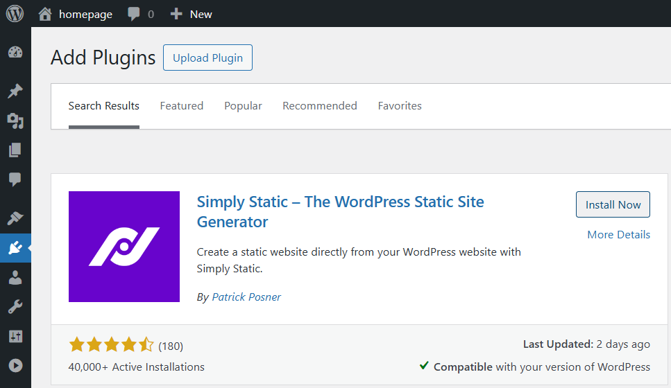

 

4. Configure settings under **Simply Static**:  
   - **General Settings**:  
     - Replace URLs: Set to **Relative Path**.  
     - Path: Specify the path of the host repository (e.g., `/new_homepage`).  
     - Enable **Force URL Replacements**.  
   - **Deploy Settings**:  
     - Deployment Method: **Local Directory**.  
     - Path: Specify the local path to the cloned host repository.  

    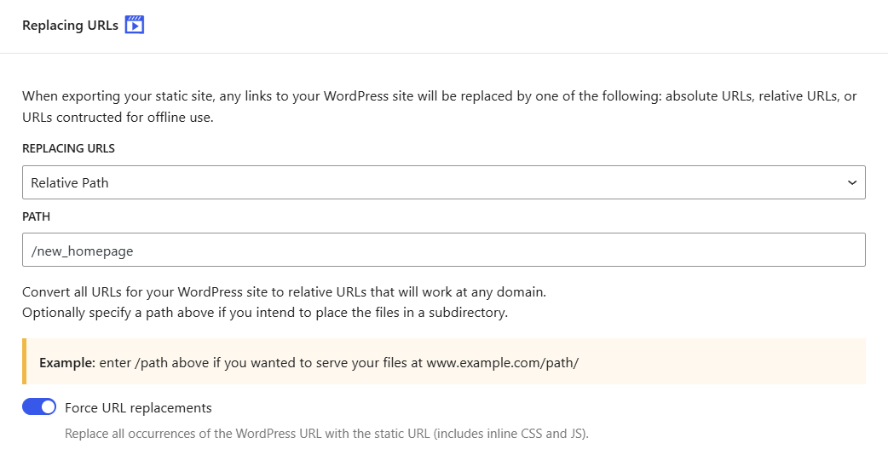

 

    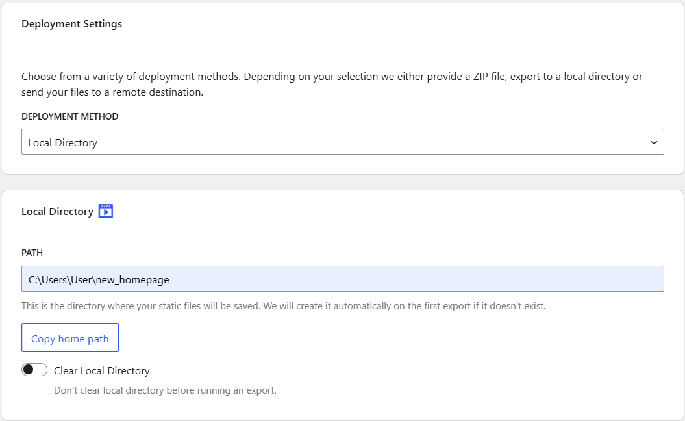

 

#### 4.2 Generate Static Files  
1. Go to **Simply Static → Generate**.  
2. Click **Generate Static Files** to export the site as static HTML with rewritten URLs.  

    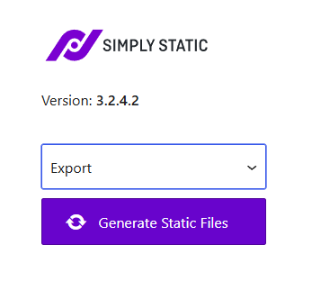

 

### Step 5: Copy Local Site Folder to Repository
1. **Locate the Local Site Folder:**  
   - Open **Local by Flywheel**.  
   - Find your site in the list and click the **Site Folder** button located below the site title.  

   

       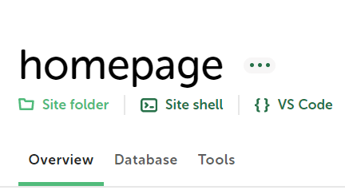
   
  

   - This folder contains the changes you made on WPAdmin and it is necessary to push these updates to your online repository.  

2. **Copy Local Site Folder Files to the GitHub Repository Path:**  
   - Copy all the files from the **Local Site Folder** into the local source repository folder (e.g., `homepage_wordpress`) set up in GitHub Desktop.  

### Step 6: Push Static HTML to GitHub  
1. **Push Changes to GitHub:**  
   - Open **GitHub Desktop**.  
   - Verify that in both the source and host repositories the changes made are visible.    
   - Push the changes to the online repositories by committing channes and by clicking **Push Origin**.  

2. **Stop the Local Site:**  
   - Before pushing or pulling any changes, stop the Local site to avoid conflicts.  
   - Click the **Stop site** button located in the top-right corner in Local by Flywheel.  

   

       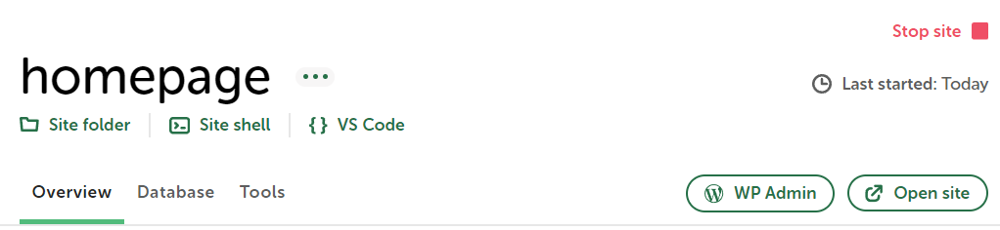
   
  

### Step 7: Repeat for Updates  
- For updates, repeat the process of generating static files and pushing them to GitHub.  

---  

## Part 2: Collaborating on an Existing Linked Website  

**Follow this section if you want to collaborate on a WordPress website that is hosted on GitHub.**  

### Step 1: Export and Import the Website  
1. In Local, click the three dots next to the site name and select **Export**.  

    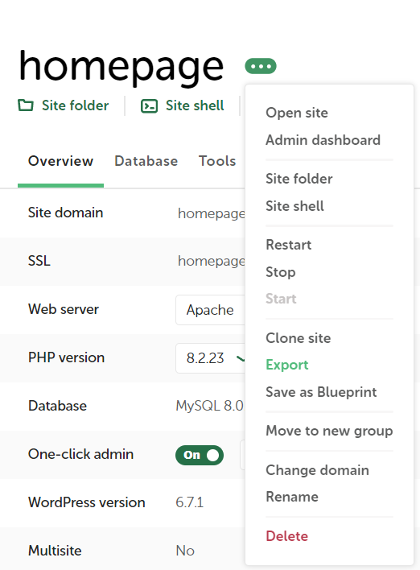

 

2. Share the ZIP file with collaborators.  
3. On the collaborator’s machine, drag the ZIP file into Local to import the site.  

### Step 2: Connect GitHub with GitHub Desktop  
1. Clone the host repository to the collaborator's GitHub Desktop, as done in **Part 1: Step 4**.  
2. For the source repository:  
   - Navigate to the imported Local site folder, which already contains a `.git` file.  
   - Add this repository locally in GitHub Desktop to sync it with the source repository on GitHub.

### Step 3: Convert WordPress to Static HTML and Push Changes  
- Follow **Part 1: Steps 4 and 6** to generate static files and push changes to GitHub. Since the imported ZIP file is already linked to the GitHub repository, you can skip **Part 1: Step 5** (Copy Local Site Folder to Repository). 

---  

By following these steps, you’ll ensure a smooth setup and collaborative workflow for a WordPress site integrated with GitHub.  